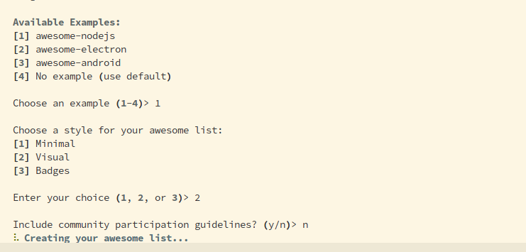
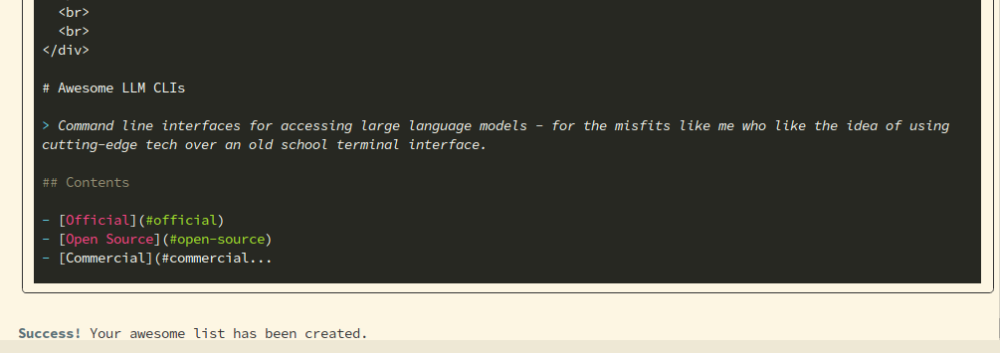
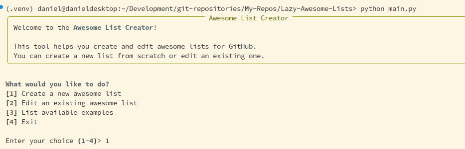
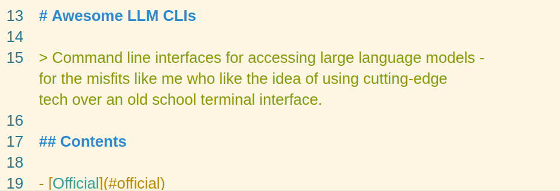

# Lazy Awesome List Builder


A simple CLI tool for creating and editing awesome lists for GitHub using AI.

## Screenshots









## Features

- Create new awesome lists from scratch with AI assistance
- Edit existing awesome lists
- Choose from different example templates
- Select different visual styles (minimal, visual, badges)
- Option to include community participation guidelines

## Installation

1. Clone this repository:
   ```bash
   git clone https://github.com/yourusername/Lazy-Awesome-Lists.git
   cd Lazy-Awesome-Lists
   ```

2. Install the required dependencies:
   ```bash
   pip install -r requirements.txt
   ```

3. Set up your API key:
   - Create a `.env` file in the root directory
   - Add your OpenAI API key: `OPENAI_API_KEY=your_api_key_here`
   - Or add your OpenRouter API key: `OPENROUTER_API_KEY=your_api_key_here`
   - Alternatively, you can enter your API key when prompted during runtime

## Usage

Run the application:
```bash
python main.py
```

### Creating a New Awesome List

1. Select option `[1] Create a new awesome list`
2. Enter the name of your awesome list
3. Provide a description of the subject
4. Choose an example template from the list
5. Select a style (minimal, visual, badges)
6. Decide whether to include community participation guidelines

The generated awesome list will be saved to the `demo-list` directory.

### Editing an Existing Awesome List

1. Select option `[2] Edit an existing awesome list`
2. Describe the edits you want to make
3. The AI will update the list based on your instructions

### Viewing Available Examples

Select option `[3] List available examples` to see the available example templates.

## Output Files

- `demo-list/awesome-list.md` - The main awesome list file
- `demo-list/starter.md` - The initial draft created by the list creator
- `demo-list/draft-edit.md` - The draft created by the list editor

## License

MIT
